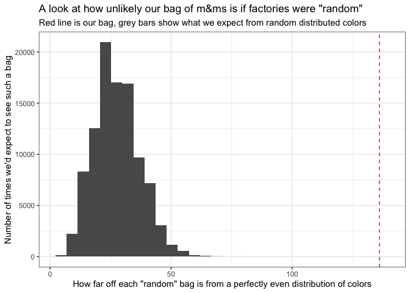

We opened a bag of m\&m candies today and saw what looked like a
surprisingly large number of green m\&ms\!


So we decided to count them. We made one “bar” for each color, where
each bar was 3 m\&ms wide. It was tough to resist eating them in the
process.

 

Then we tallied up all of the numbers, entered them into our computer,
and made a fancy bar plot. The toughest (and most important) part was
getting the official m\&m color codes so things looked pretty.

``` r
plot_data <- tribble(
  ~color, ~count, ~hex_code,
  "Red", 19, "#b11224",
  "Orange", 66,"#f26f22",
  "Yellow", 34, "#fff200",
  "Green", 81, "#31ac55",
  "Blue", 15, "#2f9fd7",
  "Brown", 22, "#603a34"
)

plot_data <- plot_data %>%
  mutate(color = factor(color, levels = color))

ggplot(plot_data, aes(x = color, y = count, color = color, fill = color)) +
  geom_bar(stat = "identity", width = 0.5) +
  geom_text(aes(label = count), vjust = -1) +
  scale_color_manual(values = plot_data$hex_code) +
  scale_fill_manual(values = plot_data$hex_code) +
  scale_y_continuous(breaks = seq(0, 80, 5)) +
  labs(x = "M & M color",
       y = "Number of M & Ms in the package") +
  theme_minimal() +
  theme(legend.position = "none",
        axis.text.x = element_text(color = plot_data$hex_code))
```

    ## Warning: Vectorized input to `element_text()` is not officially supported.
    ## Results may be unexpected or may change in future versions of ggplot2.

<!-- -->

``` r
ggsave(file = 'm_and_m_colors.pdf', width = 6.5, height = 5.5)
```

Our conclusion was that our initial hunch was right. There is a really
uneven distribution of m\&m colors with lots of greens and oranges but
few blues, browns, and reds. So it seems like the factory might not be
trying to distribute colors evenly. Now we’re wondering why that is. Is
it easier or cheaper to make green m\&ms than blue ones?\!

We can get quantitative about this by comparing how far off our bag of
m\&ms is from what we’d expect to see if the factory were trying to make
“random” bags. This could mean a process where there’s a 6-sided die,
with each color on one face. To fill a bag you roll the die, and then
put in an m\&m of that color. You repeat until the bag is filled. So we
can pretend we have such a factory and generate random bags. Then we can
see how far off the color distributions of these bags are from a
completely even distribution (with 1/6 of each color). And we can
compare how far off our bag is to this.

``` r
# first let's define a function that creates a "random bag"
# to do this we just sample a random color one at a time
# until we fill up the bag, and then count up how many of
# each color we have
simulate_random_color_selection <- function(colors = plot_data$color,
                                            n = sum(plot_data$count)) {
    counts <- table(sample(colors, size = n, replace = T))
    counts
}

# then let's create a "weirdness score", or test statistic
# that measures how far off any bag is from a perfectly
# even distribution of colors
compute_test_statistic <- function(counts) {
  total_deviation_from_mean <- sum(abs(counts - mean(counts)))
  total_deviation_from_mean
}

# now let's define a function to do this whole process once
colors <- plot_data$color
N <- sum(plot_data$count)
sample_from_null_once <- function() {
  counts <- simulate_random_color_selection(colors, N)
  total_deviation_from_mean <- compute_test_statistic(counts)
}

# and then run the whole process many many times
# simulating a factory making lots of random bags
# and measuring how uneven each one is
null_distribution <- replicate(1e5, sample_from_null_once())

# and let's measure how uneven our actual bag is
actual_test_statistic <- compute_test_statistic(plot_data$count)

# we can plot and compare them to see that our bag is surprisingly uneven!
ggplot(data.frame(null_distribution), aes(x = null_distribution)) +
  geom_histogram() +
  geom_vline(xintercept = actual_test_statistic, linetype = "dashed", color = "red") +
  labs(x = "How far off each bag is from an even distribution of colors",
       y = "Number of times we'd expect to see such a bag",
       title = "A look at how 'non-random' our bag of m&ms is",
       subtitle = "Red line is our bag, grey bars show what we expect from 'random' colors")
```

    ## `stat_bin()` using `bins = 30`. Pick better value with `binwidth`.

<!-- -->

Looks like this confirms our instincts that this bag is really far off
from what you’d expect to see from chance if the factory actually worked
that way\! (Side note, it turns out that this *isn’t* how things
actually work at the m\&m company. There are actually two factories, and
they purposely make more green m\&ms\! See
[here](https://qz.com/918008/the-color-distribution-of-mms-as-determined-by-a-phd-in-statistics/)
for more\!)
